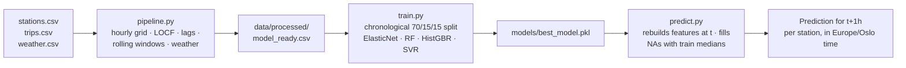

# 🚲 Bergen Bysykkel — Forecasting Bike Availability

Predicts how many bikes will be available at 9 key Bergen bike-share stations **one hour from now**, using historical station status, trip logs, and weather data.

**[▶ View the full interactive EDA notebook](https://adrianbs.github.io/Forecasting-Bike-Availability/EDA_rendered.html)** · **[📄 Read the full report (PDF)](https://github.com/AdrianBS/Forecasting-Bike-Availability/raw/main/Rapport_Prosjekt.pdf)**

---

## Results

| Model | Val RMSE | Test RMSE |
|---|---|---|
| Baseline (LOCF) | – | 1.505 |
| ElasticNet | 1.063 | – |
| HistGradientBoosting | 1.098 | – |
| RandomForest | 1.121 | – |
| **SVR (selected)** | **1.061** | **1.461** |

The best model (SVR) beats a last-observation-carried-forward baseline by ~3% RMSE on a chronological hold-out test set — modest but consistent, since bike counts change slowly hour to hour and the [...]

## A few things the data showed

<table>
<tr>
<td width="33%">
<br>
<sub><b>LOCF tracks well but lags</b> — it over/under-predicts exactly when availability is changing fastest, which is why time and traffic features matter.</sub>
</td>
<td width="33%">
<br>
<sub><b>Clear commute peaks</b> around 06:00 and 14:00 on weekdays, justifying <code>hour_of_day</code> / <code>day_of_week</code> as features.</sub>
</td>
<td width="33%">
<br>
<sub><b>Each station has its own rhythm</b> — some drain in the morning, others in the afternoon, so per-station patterns matter more than a global average.</sub>
</td>
</tr>
</table>

## How it works



1. **`pipeline.py`** — builds an hourly grid per station, forward-fills bike counts (LOCF), joins weather (resampled hourly) and trip-derived features (departures/arrivals, 3h rolling windows, n[...]
2. **`train.py`** — chronological 70/15/15 train/val/test split (no shuffling, to avoid leakage), compares ElasticNet, RandomForest, HistGradientBoosting and SVR against the LOCF baseline, and s[...]
3. **`predict.py`** — reads the latest raw data, finds the most recent timestamp, rounds up to the next full hour, rebuilds the exact same features used in training, and outputs an integer predi[...]

## Repo structure

```
├── EDA.ipynb              # exploratory data analysis (interactive Plotly charts)
├── pipeline.py             # raw data → model_ready.csv
├── train.py                 # trains + selects + saves the model
├── predict.py               # loads latest raw data → next-hour prediction
├── Rapport_Prosjekt.pdf    # full written report
└── hvordan_bruke.txt        # usage notes (Norwegian)
```

## Running it yourself

Raw data (`stations.csv`, `trips.csv`, `weather.csv`) isn't included in this repo, so the scripts aren't runnable out of the box — see the [notebook](https://YOUR-USERNAME.github.io/YOUR-REPO/ED[...]

```bash
python pipeline.py    # builds data/processed/model_ready.csv
python train.py        # trains models, saves the best one to models/
python predict.py      # prints a prediction for the next hour
```

## Stack

Python · pandas · scikit-learn · Plotly

---
*Course project, INF161 — University of Bergen, Autumn 2025.*
